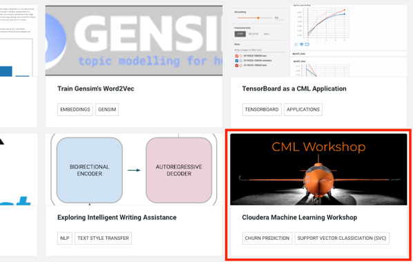
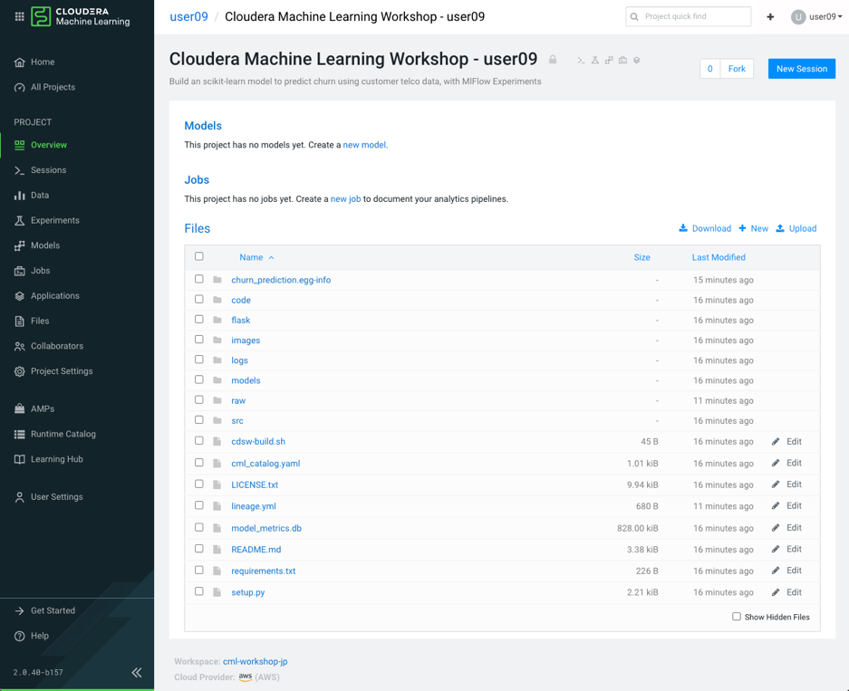
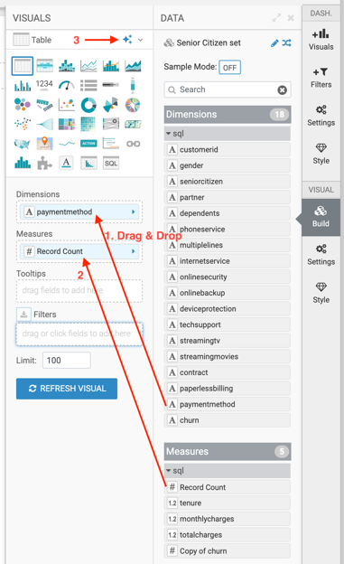
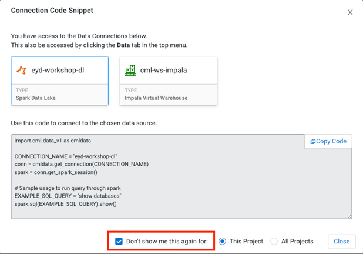
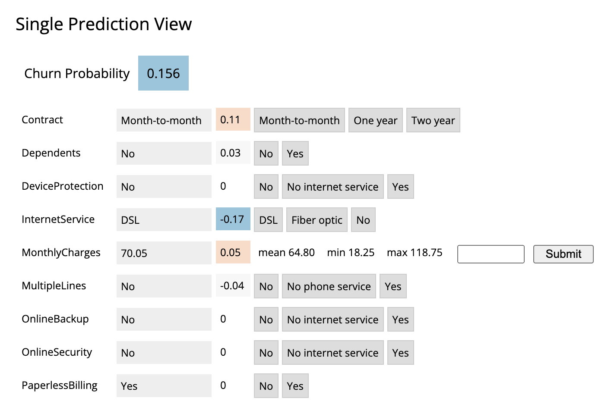

Workshop 2023

受講者ガイド

Table of Contents

:toc: macro

== Lab 0: 準備作業

このワークショップで使用するログイン情報や環境を確認します。

  .. 情報の確認とワークショップ環境へのログイン
* 情報の確認

ワークショップ環境にログインするためのユーザ名やパスワードは別添の一覧表に記載してあります。講師より一覧表を受け取って内容を確認してください。

* ログイン 
+
ワークショップ環境のURLにアクセスし、Workshop Login Username/Passwordでログインします。ログインページは以下のようなもので、初回はパスワード変更が要求される場合があります。
+

+

* CDPホーム画面が表示されるのでMachine Learningのアイコンをクリックします。

* Machine Learning Workspaces画面が表示されます。本ワークショップ用のWorkspace「 *cml-workshop-jp* 」をクリックします。

* Workspaceのホーム画面が表示されます。

== Lab 1: AMPによるプロジェクトのデプロイ

最初にワークスペースにプロジェクトをデプロイします。プロジェクトをデプロイする方法はいくつかありますが、このワークショップでは、AMP (Applied Machine Learning Prototypes)を使ってプロジェクトをデプロイします。AMPは、Cloudera Fast Forward Labsがクイックスタートの例とチュートリアルを提供するために構築したリファレンス機械学習プロジェクトです。

==== 1-1. AMPからプロジェクトの作成

* 左サイドパネルの「 *AMPs* 」をクリックします。

* AMPs画面に遷移するとたくさんのAMPが表示されます。本ワークショップで使用するAMPは一番右下にある「 *CML Workshop* 」です。「 *CML Workshop* 」をクリックします。

* モーダルが表示されるので「 *Configure Project* 」ボタンを押下します。

image:img_8.png[]
+

* プロジェクト設定画面で必要情報を入力・選択して、画面右下の
+ *「Launch Proje* ct」ボタンを押下します。（5 min）

|===
| Environment Variables               | DATA_LOCATION                       | data/churn_prototype                 
|                                     | HIVE_DATABASE                       | default                              
|                                     | HIVE_TABLE                          | *churn_prototype_* *useXX*           
| Runtime                             | Editor                              | *Workbench*                          
|                                     | Kernel                              | Python 3.7                           
|                                     | Edition                             | Standard                             
|                                     | Version                             | 2023.8                               
|                                     | Enable Spark                        | Spark 2.4.8 – CDE 1.19.2 – HOTFIX-2  
| Setup Steps                         | Execute AMP setup steps             | Check                                
|===

* セットアップ処理が実行されます。２つのステップが正常に実行されればAMPによるプロジェクトの作成は成功です。

* 左サイドパネルの「 *Overview* 」をクリックすると、プロジェクトのホームページが表示されます。プロジェクト名は「 *Cloudera Machine Learning Workshop - userNN* 」となります。

* 以下はWorkspaceにプロジェクトが作成されたイメージです。
+

image:img_12.png[]

== Lab 2: 解約モデルプロジェクト概要

本ワークショップの目的は、ある顧客グループが架空の通信会社から解約する確率を予測するロジスティック回帰分類モデルを構築することです。さらに、Local Interpretable Model-agnostic Explanations (LIME)と呼ばれる手法を用いてモデルを解釈します。ロジスティック回帰モデルとLIMEモデルの両方は、CMLのリアルタイムモデル展開機能を使用して展開され、簡単FlaskベースのWebアプリケーションを介して、ユーザがモデルと対話し、データ内のどの要因が顧客の解約確率に最も影響を与えるかを確認することができます。

* まず、プロジェクトOverview画面を説明します。Overview画面にはプロジェクトが持っている *Models* 、 *Jobs* 、 *Files* の情報が表示されています。ModelとJobはまだありませんので何も表示されていません。FilesはAMPからプロジェクト作成時にリポジトリからダウンロードしたファイルです。

* Overview画面の下部には「 *README.md* 」の内容が表示されます。

* 次にプロジェクトのファイルの構成を見てみます。

* 「 *code* 」ディレクトリのファイルを見てみます。「 *code* 」ディレクトリにあるノートブック、スクリプト、ドキュメントに従うことで、CML上で同様の分類タスクを実行する方法や、プラットフォームの主要な機能を利用する方法を理解することができます。これらの機能には以下が含まれます。
* Sparkによるデータの取り込みと操作
* 合理化されたモデル開発と実験
* RESTful APIエンドポイントへのポイント＆クリックによるモデルデプロイメント
* フロントエンドのMLアプリケーションをデプロイするためのアプリケーションホスティング
* モデルガバナンスとモードパフォーマンスメトリクスのトラッキングを含むモデル運用

* LabとCodeファイル関係は以下のようになります。

* 本ワークショップで使用する「顧客解約データ」です。

|===
| Column (21)      | Type             | Description      | Sample           |                   
| customerid       | string           | 顧客ID             | 7590-VHVEG       | 5575-GNVDE        
| gender           | string           | 性別               | Female           | Male              
| seniorcitizen    | string           | シニア              | 0                | 0                 
| partner          | string           | パートナーの有無         | Yes              | No                
| dependents       | string           | 扶養家族の有無          | No               | No                
| tenure           | double           | 契約期間             | 1                | 34                
| phoneservice     | string           | 電話サービス           | No               | Yes               
| multiplelines    | string           | 複数回線             | No phone service | No                
| internetservice  | string           | インターネットサービス      | DSL              | DSL               
| onlinesecurity   | string           | オンラインセキュリティ      | No               | Yes               
| onlinebackup     | string           | オンラインバックアップ      | Yes              | No                
| deviceprotection | string           | デバイス保護           | No               | Yes               
| techsupport      | string           | テクニカルサポート        | No               | No                
| streamingtv      | string           | ストリーミングTV        | No               | No                
| streamingmovies  | string           | 映画ストリーミング        | No               | No                
| contract         | string           | 契約               | Month-to-month   | One year          
| paperlessbilling | string           | ペーバーレス請求         | Yes              | No                
| paymentmethod    | string           | 支払い方法            | Electronic check | Mailed check      
| monthlycharges   | double           | 月額料金             | 29.85            | 56.95             
| totalcharges     | double           | 合計料金             | 29.85            | 1889.5            
| churn            | string           | 解約               | No               | No                
|===

== Lab 3: データ可視化

このLabでは、Machine Learningプロジェクトから Data Warehouseへ接続し、CMLにデプロイされたData Visualizationでデータを可視化します。可視化するデータは本ワークショップで使用する「 *顧客解約データ* 」です。

==== 3-1. Data Visualization の起動

* 左サイドパネルの「 *Data* 」をクリックし、Data画面に切り替えます。

* 「 *Launch Data Application* 」ボタンを押下します。（2 min）

* Data Visualization が起動すると Data Visualizationのホーム画面が表示されます。

+

+

==== 3-2. データセットの作成

プロジェクトのセットアップ時に自動で作成された Data Warehouseの「 *churn_prototype_<UserId>* 」テーブルに接続し、SQLによるデータセットを作成します。

* Data画面上部の「SQL」タブを選択します。

* SQL画面のエディタに以下のSQLを記述し、「 *RUN* 」ボタンを押下してSQLを実行します。Data Connection は「 *cml-ws-impala* 」、Databaseは「 *default* 」が選択されていることを確認してから実行してください。

* 画面下部の *Results* に結果が表示されます。「 *SAVE AS DATASET* 」ボタンを押下します。

image:img_26.png[]

* *New Dataset* 画面に切り替わるので、Dataset title フィールドに
+ *「Senior Citizen s* et」を入力し *、「CREA* TE」ボタンを押下して、データセットを作成します。

* 作成したデータセットのフィールドを編集します。作成したデータセット
+ *「Senior Citizen s* et」が表示されるので名前をクリックします。

* データセット「 *Senior Citizen set* 」の詳細が表示されます。
+
Detail画面のサイドパネルから Fields を選択します。Fields画面が表示されるので
+
画面 *上部の「EDIT FI* ELDS」をクリックします。

* Dimensionsの一番下にある「 *churn* 」フィールドの右端の下矢印をクリックし、「 *Clone* 」をクリック。

* Dimensions リストの一番下にある 「 *Copy of churn* 」フィールドを見つけ、そのタイプを *Mes(ure)* に、タイプを *A(string)* から *＃(integer)* に変更します。画面上部にある「 *SAVE* 」ボタンを押下して、変更を保存します。

==== 3-3. ダッシュボードの作成

作成したデータセットからダッシュボード上にビジュアルを作成します。

* 画面上部の「 *VISUALS* 」タブを選択し、「 *NEW DASHBOARD* 」ボタンを押下します。

* 右サイドパネルの「 *ADD VISUALS* 」で、コネクションは「 *cml-ws-impala* 」を
+
選択、データセットは先ほど作成し *た「Senior Citizen s* et」を選択し、 *+
「New Vi* sual」ボタンをクリックします。

* ダッシュボードにテーブルのビジュアルが表示されます。
+
右サイドパネル *の「Bui* ld」で *、「VISUA* LS」のDimensionsとMeasures *に「DA* TA」 *の「paymentmeth* od」 *と「Record Cou* nt」をそれぞれにドラッグ＆ドロップし、上部の星印をクリックしてビジュアルを検索します。

* 表示されたビジュアルの候補から「 *Horizontal bars* 」を選択します。ビジュアルがテーブルから Horizontal barsに変更されました。
+
※他のビジュアルを選択しても構いません。

* ダッシュボードタイトルに「 *解約モデルデータ* 」、ビジュアルタイトルに
+ *「シルバー世代の決済* 方法」を入力し *、「SA* VE」ボタンを押下してダッシュボードを保存します。

* 保存されたら「 *VIEW* 」ボタンを押下し、ダッシュボードが表示されることを確認します。

== Lab 4: データ探索

CML Sessionを使用すると、R、Scala、Pythonのコードを実行するなどのアクションを実行できます。また、インタラクティブなコマンドプロンプトやターミナルにもアクセスできます。このLabではWorkbenchセッションを立ち上げ、いくつかのコマンドとスクリプトを実行してみます。JupyterLabでもスクリプトを実行し、「顧客解約データ」を探索してみます。

==== 4-1. セッションの起動（Workbench）

* 左サイドパネルの *Overview* をクリックします。

+

* 画面右上の「 *New Session* 」ボタンを押下します。

* 「 *Start A New Session* 」モーダルに必要事項を設定し、「 *Start Session* 」ボタンを押下します。

|===
| Session Name                       |                                    | telco_churn_session_wb              
| Runtime                            | Editor                             | Workbench                           
|                                    | Kernel                             | Python 3.7                          
|                                    | Edition                            | Standard                            
|                                    | Version                            | 2023.8                              
|                                    | Enable Spark                       | Spark 2.4.8 – CDE 1.19.2 – HOTFIX2  
| Resource Profile                   |                                    | 1 vCPU/2 GiB Memory                 
|===

* 「 *Connection Code Snippet* 」モーダルが表示されますが、「 *Don’t show me this again* 」をチェックオンにして「 *Close* 」ボタンを押下してください。

* Workbench画面が表示されます。右下の対話型コマンドプロンプトの左の縦線が赤色から緑色に変われば起動完了です。

image:img_44.png[]
+

+

+

+

* 対話型コマンドプロンプトに"Hello World”を打ってみましょう。コマンドプロンプトに「print('Hello World')」を入力し、エンターを実行します。Session上で実行され、結果が表示されます。

image:img_46.png[]

* 次にターミナルを起動してみましょう。画面上部の「Terminal Access」をクリックします。

+
ターミナル画面が起動します。

* ターミナル画面でPodにインストールされているPythonライブラリのリストを表示してみましょう。ターミナル画面のプロンプトに「pip3 list」を入力してエンターします。事前にインストールされているPythonライブラリが表示されます。

* 次にWorkbench画面に戻り、ファイルからコードを実行してみます。Workbench画面の左サイドのファイルパネルから「 *code/1_data_ingest.py* 」を選択し、コード編集画面に表示させます。

* コード編集画面の上部の「Run」をクリックし、「 *Run All* 」を実行します。

* 表示されているコードがSession上で実行されます。右画面に実行中のコードと結果が順次表示されます。コードの実行中はコマンドプロンプトの左端のカーソルが赤になることがわかります。終了するとカーソルは緑に戻ります。

==== 4-2. ジョブの登録・実行

Sessionはインタラクティブなコマンド実行ツールですが、コードをスケジュールにより定期実行したい場合はジョブを使用します。先ほどと同じコードをジョブとして登録し、実行してみます。

* プロジェクトのOverview画面に戻ります。Workbench画面の右上部にある
+ *「←Proje* ct」をクリックします。

image:img_53.png[]

* 左サイドパネルの「 *Jobs* 」もしくはOverview画面の「 *Jobs* 」リンクをクリックしてJobs画面を表示します。

* 画面右上の「 *New Job* 」ボタンを押下します。

* 「 *Create a Job* 」画面が表示されるので、必要情報を入力します。

|===
| Name                               |                                    | *Ingestion job*                     
| Script                             |                                    | *Code/1_data_ingest.py*             
| Arguments                          |                                    | (空)                                 
| Runtime                            | Editor                             | Workbench                           
|                                    | Kernel                             | Python 3.7                          
|                                    | Edition                            | Standard                            
|                                    | Version                            | 2023.8                              
|                                    | Enable Spark                       | Spark 2.4.8 – CDE 1.19.2 – HOTFIX2  
| Schedule                           |                                    | Recurring                           
|                                    |                                    | Every day at 6:0                    
| Resource Profile                   |                                    | 1 vCPU/2 GiB Memory                 
|===

* 画面下部にある「 *Create Job* 」ボタンを押下してジョブを作成します。

* 登録したジョブを即時実行してみましょう。登録したジョブの右端にある「 *Run as me* 」をクリックし、ジョブを実行します。

* ジョブが正常に実行されたことをStatusで確認します。

* ジョブ名をクリックし、ジョブの詳細画面を表示します。

* ジョブもPodとして起動します。

==== 4-3. JupyterLabを使ったインタラクティブな分析

前のセクションではWorkbenchを起動し、Pythonスクリプトを実行しました。このセクションでは、Jupyter Notebookを使用し、Pythonコマンドを実行して、データを探索します。

* Sessions画面に戻り、画面右上の「 *New Session* 」ボタンを押下します。

image:img_62.png[]　　image:img_63.png[]

* *JuypyterLab* セッションを起動します。

|===
| Session Name                       |                                    | *telco_churn_session_jupyter*       
| Runtime                            | Editor                             | *JupyterLab*                        
|                                    | Kernel                             | Python 3.7                          
|                                    | Edition                            | Standard                            
|                                    | Version                            | 2023.8                              
|                                    | Enable Spark                       | Spark 2.4.8 – CDE 1.19.2 – HOTFIX2  
| Resource Profile                   |                                    | 1 vCPU/2 GiB Memory                 
|===

* *JuypterLab* が起動したら、ノートブック「 *code/2_data_exploration.ipynb* 」を表示します。左サイドパネルから「 *code/2_data_exploration.ipynb* 」を
+
ダブルクリックします。

* 表示した「 *2_data_exploration.ipynb* 」を実行します。「Run」メニューから「 *Run All Cells* 」を選択します。

* 全てのコマンドが正常終了したことを確認します。

* 実行したコマンドの詳細をJuypterLabの結果を見て確認します。
+

* JupyterLabセッションとしてPodを起動しました。

== Lab 5: モデルの作成とトレーニング

あらかじめ用意されているスクリプトを使ってモデルを作成し、データを使ってトレーニングします。SessionはLab4で使用したJuypterLab Sessionを引き続き使用します。

==== 5-1. JupyterLabでのモデル作成

ノートブック 「 *3_model_building.ipynb* 」では、 *scikit-learn* と *LIME* を使ってモデルを作成し、プロジェクトに保存します。CMLでは、pipでオープンソースのライブラリやフレームワークをインストールすることでそれらと容易に連携することができます。

* ノートブック「 *code/3_model_building.ipynb* 」を開きます。

* 表示した「 *code/3_model_building.ipynb* 」を実行します。「Run」メニューから「 *Run All Cells* 」を選択します。

+

* 全てのコマンドが正常終了したことを確認します。

* モデル生成のコードの詳細を確認します。

train_test_split 関数を使用して、データセットをトレーニングデータとテストデータに分割します。X は特徴行列で、y はターゲット変数です。random_state=42 は乱数のシードを指定して再現性を確保します。

ロジスティック回帰モデルを作成します。交差検証（5分割交差検証）を使用して、モデルの正則化パラメータ（C）を選択するために LogisticRegressionCV を使用します。solver は最適化アルゴリズムを指定し、max_iter は最適化の反復回数を設定します。

+
Pipeline クラスを使用して、機械学習パイプラインを作成します。このパイプラインは複数のステップから構成されており、各ステップはパイプライン内で連続的に適用されます。

ct ステップ：カテゴリカル特徴量のワンホットエンコーディングを実行します。

scaler ステップ：数値特徴量の標準化（正規化）を実行します。

clf ステップ：ロジスティック回帰分類器 (LogisticRegressionCV) をトレーニングします。

パイプラインを使用してトレーニングデータ X_train と y_train を使用してモデルをトレーニングします。パイプラインを使用してトレーニングデータとテストデータでモデルの性能を評価し、トレーニングスコア、テストスコアを計算し、出力します。

* ロジスティック回帰モデルのテスト結果を見てみます。

正解率（Accuracy）予測結果全体がどれくらい真の値と一致しているかを表す指標です。

適合率（Precision）とは、ポジティブクラスと予測したサンプルの中に、どのくらい正しく予測できたかの割合です。予測結果が陽性になったものを注目しています。ネガティブサンプルの誤認識（FP）が多いほど、適合率が低くなります。

再現率（Recall）とは、ポジティブクラスの中にどのくらい正しく予測できたかの割合です。正解が陽性になったものを注目しています。ポジティブサンプルの見逃し（FN）が多いほど、再現率が低くなります。

F値（f1_score）は、適合率と再現率の調和平均であり、２つの指標をまとめて評価することになります。

比較としてランダムフォレストのテスト結果も見てみます。

* 予測値の説明にはLIMEを用いています。
+

+
LIMEとは、（Local Interpretable Model-Agnostic Explanations）の頭文字をとったもので、個々の予測を説明するために、あらゆるブラックボックスの機械学習モデルを局所的で解釈可能なモデルで近似する手法で、どの特徴が予測値に最も大きな影響を与えるかを決定する方法です。

* 最後にモデルを保存します。

* 生成されたモデルのpickleファイルを確認します。Jupyter Lab画面のファイルブラウザで「 *models/telco-linear/telco-linear.pkl* 」ファイルが存在することを確認します。これがベースラインモデルになります。

* JupyterLab Sessionを終了します。画面右上の「 *Stop* 」をクリックして、Sessionを終了し、プロジェクトの「 *Start A New Session* 」画面に戻ります。

==== 5-2. モデルのトレーニング

このセクションでは、モデルのトレーニングスクリプトをより強固にします。さらに、"最良 "の結果をもたらすモデルパラメータを見つける段階に入ります。CMLではデータサイエンティストが実験実行の収集、記録、比較を柔軟に行えるようにするフレームワークとして *mlflow* をすぐに使える形で提供しています。

* Workbenchセッションを起動します。

|===
| Session Name                       |                                    | *telco_churn_session_training*      
| Runtime                            | Editor                             | *Workbench*                         
|                                    | Kernel                             | Python 3.7                          
|                                    | Edition                            | Standard                            
|                                    | Version                            | 2023.8                              
|                                    | Enable Spark                       | Spark 2.4.8 – CDE 1.19.2 – HOTFIX2  
| Resource Profile                   |                                    | 1 vCPU/2 GiB Memory                 
|===

* 左ファイルブラウザで「 *code/4_train_model.py* 」ファイルを開き、コード編集画面に表示します。

* コード編集画面の上部にある▶️ボタンを押下して、コードを実行します。（5 min）

+
※ Runメニューか *ら「Run A* ll」を実行するのと同じ

* 処理が正常終了したことを確認します。このスクリプトでは、最良の結果を得るためにモデル学習中に操作する2つのパラメータとして、"kernel "と "max_iter "を使用します。ここでは、"best "を最も高い "test_score "と定義します。
* プロジェクトのOverview画面に戻ります。Workbench画面の右上部にある
+ *「←Proje* ct」をクリックします。

* 左サイドパネルの「 *Experiments* 」をクリックします。
+ *「Churn Model Traini* ng」が表示されるので、名前をクリックします。

* Experimentの結果が表示されます。

* 予想通り、max_iterの数が多いほど良い結果（より高いtest_score）が得られます。

* 次にmlflowに組み込まれたビジュアライゼーションにより、実験の実行と結果をより詳細に比較してみます。Kernelが「 *linear* 」の行を選択し、「 *Compare* 」ボタンを押下します。

* 比較結果が表示されます。

* 項目から「test_score」を見つけ、クリックします。test_scoreを比較した棒グラフが表示されます。

* 「code/4_train_model.py」の一部を見てみます。
+

153行目でtrain_test_split関数を使用してトレーニングデータ（X_train, y_train）とテストデータ（X_test, y_test）を分割しています。

164行目でSVMのカーネル関数を指定しています。今回は”linear”（ 直線的な決定境界を作成）と"rbf”（非線形）を比較のために指定しています。

172行目でmlflowの実験ランを呼び出します。

177行目でSVC クラスを使用して、指定されたカーネルと最大イテレーション数を持つSVMモデルを作成します。probability=True は確率を計算するために設定されています。

179行目でトレーニングデータ X_train と y_train を使用してモデルをトレーニングします。

182、183行目でトレーニングデータおよびテストデータ上でモデルのスコアを計算し、train_score2 と test_score2 に格納します。また、datadf データフレームにモデルの予測確率を追加します。

186、187行目でトレーニングスコアとテストスコアをログに記録します。これにより、各実験ランのパフォーマンスがトラッキングされます。

== Lab 6: モデルのデプロイ

トレーニングされたモデルをビジネスアプリケーションが利用できるようにモデルをデプロイし、RESTエンドポイントを作成します。モデルのエンドポイントもPodによってホストされます。CMLのModelsはモデルのトラッキング、メタデータ、バージョン管理機能を提供し、本番環境でのモデルの管理を可能にします。

==== 6-1. モデルのデプロイ

* 左サイドパネルの「Models」をクリックします。Models画面が表示されるので右上の「New Model」ボタンを押下します。

* 「Deploy a Model」画面で必要情報を入力します。

|===
| Name                                               | *Churn Model API Endpoint*                          
| Description                                        | *Predicts and explains customer churn probability*  
| Enable Authentication                              | Check off                                           
|===

|===
| File                              |                                   | *code/5_model_serve_explainer.py*  
| Function                          |                                   | *explain*                          
| Example Input                     |                                   | *別記載*                              
| Example Output                    |                                   | (空)                                
| Runtime                           | Editor                            | Workbench                          
|                                   | Kernel                            | Python 3.7                         
|                                   | Edition                           | Standard                           
|                                   | Version                           | 2023.8                             
|                                   | Enable Spark                      | *Uncheck*                          
|===

Example Input の内容

|===
| Resource Profile     | 1 vCPU/ 2 GiB Memory  
| Replicas             | 1                     
|===

* 画面の一番下にある「 *Deploy Model* 」を押下します。（2 min）

* Statusが *Deployed* になればデプロイは完了です。モデル名をクリックします。

* モデルの詳細情報が表示されます。ここではモデルのテストを実施することができます。画面左下の「 *Test* 」ボタンを押下します。テストは、モデルエンドポイントへのリクエストをシミュレートします。モデルは入力を処理し、メタデータと顧客の予測とともに出力を返します。さらに、リクエストには一意の識別子が割り当てられます。このメタデータは後のLab 8でML Opsのために使います。

* モデルのテスト結果が表示されます。正常終了を確認します。

* モデルのエンドポイントとなる「code/5_model_serve_explainer.py」の「explain」関数をを見てみます。

207行目で「telco_linear」モデルをロードしています。

218行目、explain関数はJSON形式の入力データを受け取り、入力データをデフォルトのデータと連結し、データの辞書を作成します。

219行目でデータの型をモデルの要件に合わせてキャストします。

220行目でem.explain_dct(data) を呼び出して、モデルの解釈可能性を計算します。これにより、モデルの予測確率と説明情報が取得されます。

223〜229行目でcdsw.track_metric を使用して、入力データ、予測確率、および説明情報をモデルメトリクスとして記録します。

最終的に、入力データ、予測確率、および説明情報を含むJSONを返します。

==== 6-2. モデルのパフォーマンス・シミュレーションの実行

次のセクションに進む前に、モデルのパフォーマンスをシミュレートするスクリプトを実行します。

* Sessions画面に戻り、画面右上の「 *New Session* 」ボタンを押下し、新しいセッションを起動します。

　　
+

* Workbenchセッションを起動します。

|===
| Session Name                       |                                    | *telco_churn_session_simulation*    
| Runtime                            | Editor                             | *Workbench*                         
|                                    | Kernel                             | Python 3.7                          
|                                    | Edition                            | Standard                            
|                                    | Version                            | 2023.8                              
|                                    | Enable Spark                       | Spark 2.4.8 – CDE 1.19.2 – HOTFIX2  
| Resource Profile                   |                                    | 1 vCPU/2 GiB Memory                 
|===

* 左ファイルブラウザで「 *code/7a_ml_ops_simulation.py* 」ファイルを開き、コード編集画面に表示します。

* コード編集画面の上部にある▶️ボタンを押下して、コードを実行します。

* このスクリプトはモデルへの1000回の呼び出しを生成します。
+
このスクリプトの終了を待たずに次のパートへ進んでください。

* プロジェクトのOverview画面に戻ります。Workbench画面の右上部にある
+ *「←Proje* ct」をクリックします。

image:img_109.png[]

== Lab 7: ビジネスアプリケーションのデプロイ

モデルのRESTエンドポイントをコールするビジネスアプリケーションをCML内にホストします。本ワークショップではCML ApplicationsにFlaskを使ったビジュアルツールをデプロイします。このビジュアルツールはリクエストを モデルのエンドポイントに転送し、レスポンスを視覚的に表示します。

==== 7-1. アプリケーションデプロイの事前作業

* プロジェクトのOverview画面のModelsに表示されている「 *Churn Model API Endpoint* 」をクリックするか、左サイドパネルのModelsをクリックしてModels画面に遷移し、そこに表示されている「 *Churn Model API Endpoint* 」をクリックしてください。

* モデル詳細画面の「 *Settings* 」タブを選択し、「 *Access Key* 」に表示されている文字列をコピーします。アプリケーションからモデルのAPIへ接続する際に必要です。

* Access Keyをアプリケーションのコードに埋め込みます。左サイドパネルの「 *Files* 」をクリックし、「 *flask/single_view.html* 」を開きます。

* 画面左上の「 *Open in Session* 」をクリックします。

* Workbench画面で該当ファイルが開きます。61行目のaccessKey変数への代入式の値を先ほどコピーしたモデルのAccess Keyに書き換えます。
* Sessionを起動する必要はありません。ファイルを修正するだけです。

image:img_115.png[]

* ファイルを保存します。画面上部のメニュー「ファイル」をクリックし、「保存」をクリックします。

* プロジェクトのOverview画面に戻ります。Workbench画面の右上部にある
+ *「←Proje* ct」をクリックします。

image:img_117.png[]

==== 7-2. ビジネスアプリケーションのデプロイ

* 左サイドパネルの「 *Applications* 」をクリックし、Applications画面を表示します。画面右上にある「 *New Application* 」ボタンを押下します。

* 「 *Create an Application* 」画面が表示されるので必要情報を入力します。画面の
+
一番下にあ *る「Create Applicati* on」を押下します。(2 min)

|===
| Name                               |                                    | *Customer Churn Explainer*          
| Subdomain                          |                                    | *churn-<UseID>*                     
| Runtime                            | Editor                             | Workbench                           
|                                    | Kernel                             | Python 3.7                          
|                                    | Edition                            | Standard                            
|                                    | Version                            | 2023.8                              
|                                    | Enable Spark                       | Spark 2.4.8 – CDE 1.19.2 – HOTFIX2  
| Resource Profile                   |                                    | 1 vCPU/2 GiB Memory                 
|===

* アプリケーションが起動するとApplications画面にタイルが表示されます。「 *Customer Churn Explainer* 」タイルをクリックします。

* 自動的にビジュアル・アプリケーションのランディング・ページにリダイレクトされます。

左側の確率（Probability）列に注目してください。これは、機械学習モデルによって予測されたターゲット変数で、各顧客が解約する確率を表示しています。例えば0.49の値は、顧客が解約する確率が49%であることを表します。デフォルトでは、確率が50%より高い場合、Classifierはその顧客を "解約する "とラベル付けし、そうでない場合は "解約しない "とラベル付けします。

50%の閾値は増減し、以前は "will churn "ラベルを割り当てられていた顧客が、"will not churn "に反転する可能性があります。

* 表の上部にある顧客をクリックすると詳細画面に遷移します。この顧客は58.5％の確率で解約します。
+
分類器に適用されるLimeモデルは、この特定の顧客に適用される予測ラベルにおいて最も影響力のある特徴を強調する色分けスキームを提供します。
+
例えば、この顧客の "解約する "という予測は、"インターネット・サービス "の特徴に大きく影響されています。濃い赤の色分けは、この顧客が現在の特徴値からマイナスの影響を受けていることを示します。

現在の「月額料金」と「電話サービス」の値も解約の可能性を高めますが、「ストリーミング映画」と「合計料金」の値は解約の可能性を下げます。

* このシナリオで最も影響力のある機能「インターネット・サービス」の値を変更したらどうなるか見てみましょう。現在、値は「光ファイバー」に設定されています。表のエントリにカーソルを合わせ、「DSL」を選択します。

テーブルがリロードされ、この顧客の解約確率は約15％に劇的に減少しました。

このシンプルな分析は、マーケターがさまざまなビジネス目標に従って戦略を最適化するのに役立ちます。例えば、この貴重な情報に基づいて、積極的なマーケティング・オファーを調整することができ、更により徹底的な財務分析を上記のシミュレーションに結びつけ、おそらく50％の閾値を調整して、ビジネスの制約や各顧客に割り当てられた顧客生涯価値に基づいて選択性を増減させることができます。

== Lab 8: MLOps モニタリング

このラボは、「6-2. モデルのパフォーマンス・シミュレーションの実行」を実施していることが前提となります。もし実行していない場合は、モデルシミュレーションスクリプトを実行してください。

==== 8-1. モニタリングスクリプトの実行

* 新しいセッションを起動します。

|===
| Session Name                       |                                    | *telco_churn_session_ops*           
| Runtime                            | Editor                             | *Workbench*                         
|                                    | Kernel                             | Python 3.7                          
|                                    | Edition                            | Standard                            
|                                    | Version                            | 2023.8                              
|                                    | Enable Spark                       | Spark 2.4.8 – CDE 1.19.2 – HOTFIX2  
| Resource Profile                   |                                    | 1 vCPU/2 GiB Memory                 
|===

* セッションが起動したら、「 *code/7b_ml_ops_visual.py* 」を開きます。スクリプトを実行します。

* 結果のハイライトは以下の通りです。

モデルの予測値は CML Models Metrics Store で追跡されます。
+
これはPythonのデコレーターとスクリプト「5_model_serve_explainer.py」の 「cdsw.track_metrics」メソッドの使用によって可能になります。

その後、予測と関連するメタデータを抽出し、Pandasのデータフレームに入れることができます。これはまさに、画面右側の最初の図が示しているものです。各列はCMLモデルのエンドポイントに到達した予測リクエストを表します。各行は CML Models Metrics Store で追跡しているメトリックを表します。

一旦追跡されたメトリクスがPythonのデータ構造に保存されると、それらはあらゆる目的に利用することができます。

例えば、2番目の図はSeabornの基本的な折れ線グラフで、モデルの出力確率が時間の関数としてプロットされています。X軸には各リクエストに関連するタイムスタンプが表示されます。Y軸は関連する出力確率です。

同様に、3番目の図のように処理時間をプロットすることができます。これは特定のリクエストを処理するのに必要な時間を表します。

例として、この情報は、特定のしきい値を通過したときに、このモデルのエンドポイントをサポートするためにより多くのリソースのデプロイをトリガーするために使うことができます。UI を使って手動でリソースをデプロイすることもできますし、CML APIv2 と CML ジョブを使ってプログラムで自動化された CI/CD パイプラインでより多くのリソースをデプロイすることもできます。

モデルの精度を経時的にモニターすることもできます。例えば、下図は予測精度を経時的に並べ替えた折れ線グラフです。見てわかるように、トレンドは負で、モデルの予測精度はどんどん低下しています。

処理時間や他のメトリクスと同様に、CML ではモデル管理に関連するアクションを自動化する ML Ops パイプラインを実装することができます。例えば、CML ジョブと CML APIv2 を組み合わせて、モデルの精度が特定の期間に特定の閾値に達したときに、モデルの再トレーニングと再デプロイメントをトリガーすることができます。

これは比較的基本的な例です。CMLはハンズオン開発者のためのオープンなプラットフォームであり、ユーザーはより複雑なML Opsパイプラインを自由に実装することができます。

グランド・トゥルース・メトリクスは「cdsw.track_delayed_metrics」メソッドで収集できます。これにより、予測が出力された後の実際のイベントと予測を比較することができます。その結果、モデルの精度を計算し、上のようなビジュアライゼーションを作成することができます。

「cdsw.track_delayed_metrics」メソッドの例として、"7a_ml_ops_simulation.py "スクリプトを開き、249行目から269行目までを確認してください。これは単なるシミュレーションであることに留意してください。

現実世界のシナリオでは、リクエストは外部システムから来るか、SQLかNoSQLデータベースに記録されるでしょう。そして、上記のスクリプトは CML ジョブでバッチ的に、あるいは CML モデルエンドポイントでリアルタイムにグランドトゥルース値を設定するために使われるでしょう。

*ワークショップが終了しました！*

*ご参加いただき、本当にありがとうございました。*

*これを機にCMLをご利用いただけることを願っています。*

*またのご参加をお待ちしております。*

image:img_133.png[]

---

Cloudera, Inc. 5470 Great America Pkwy, Santa Clara, CA 95054 USA https://www.cloudera.com/[cloudera.com]

© 2022 Cloudera, Inc. All rights reserved. Cloudera and the Cloudera logo are trademarks or registered trademarks of Cloudera Inc. in the USA and other countries. All other trademarks are the property of their respective companies. Information is subject to change without notice. 0000-001 January 01, 2021